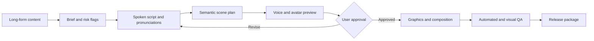

# Kanvis Video

English | [中文](README.md)

> Do not merely read an article aloud. Direct it into a video.

Kanvis Video is the open-source video-production layer of Kanvis System. It turns long-form content into directed, release-gated video projects with Codex Skills and hands them to the local Kanvis Studio workspace for inspection and editing.

Its first bundled workflow is `kanvis-article-to-video`: long-form content becomes a visually directed project across human enhancement, faceless visual, and authorized avatar modes, with multilingual voice and caption paths.

Current version: `v0.3.0`

## Naming and scope

| Name | Responsibility |
|---|---|
| **Kanvis System** | Umbrella brand for Skills, Content OS, Studio, and future operating systems |
| **Kanvis Content OS** | Obsidian content management and content assets; not this repository |
| **Kanvis Video** | This repository: video Skills, project contracts, QA, and Studio handoff |
| **Kanvis Article to Video** | First Skill, invoked as `$kanvis-article-to-video` |
| **Kanvis Studio** | Local canvas, timeline, inspection, adjustment, rendering, and future project export |

`Kanvis Cut` is retired as a product name because the workspace does substantially more than cutting.

## Why it exists

Most avatar tools start with a finished script and return a talking-head clip. Kanvis Video starts with the article. It decides what to say, how to say it, which claims need visual evidence, and when the presenter should move aside for the information.

It is not another talking-head generator. It is an editorial video production pipeline.

## How it differs from digital-human talking-head skills

This project is not centered on "generate one avatar clip." It is centered on "direct long-form content into a publishable video project."

| Dimension | Digital-human talking-head skill | Kanvis Video |
|---|---|---|
| Starting point | Finished script, portrait, and voice source | Long-form article, WeChat post, course script, or Markdown document |
| Core problem | Safely coordinate voice/avatar providers | Adapt, storyboard, visualize, and release-gate article content |
| Screen strategy | Presenter-led talking head | Information graphics, evidence, process, comparison, and presenter PIP |
| Success criterion | Authorized avatar video generation | Source fidelity, visual information density, controlled cost, publish-ready QA |
| Contribution focus | Provider API, asset preflight, job state | Spoken adaptation, semantic scene grammar, layout presets, platform QA |

If you already have a finished script and only need an authorized talking-head clip, this is not the shortest path.
If you have articles, course scripts, or knowledge-base content that need visual structure, this is the intended scope.

Maintainers can use [docs/positioning-vs-talking-head-skills.md](docs/positioning-vs-talking-head-skills.md) to keep public communication centered on the directed content-to-video pipeline, not a provider pairing or talking-head clone.

## What makes it different

- **Article-native**: preserve the source, separate sourced claims from transitions, and adapt prose instead of reading paragraphs verbatim.
- **Semantic visual direction**: choose comparison, process, hierarchy, number, evidence, quote, and diagram scenes from meaning.
- **Presenter-aware composition**: use the avatar as a presenter, picture-in-picture guide, or omit it when evidence needs the full canvas.
- **Provider-adaptable**: coordinate HeyGen, ElevenLabs, MiniMax, local CosyVoice, or future adapters through portable contracts.
- **Cost and consent gates**: support `off`, `confirm`, and `auto` paid-call policies, cost ceilings, previews, and resumable job state.
- **Release-gated output**: verify media properties, consent, and visual review before setting `publish_ready` to `true`.

## Pipeline



## Current scope

This is a **Codex orchestration Skill**, not a hosted service or a bundled provider SDK. It provides production rules, portable data contracts, deterministic helper scripts, a local CosyVoice guide, a privacy-safe example, tests, and CI.

Voice, avatar, and rendering operations are performed by provider adapters and HyperFrames tools available in the user's Codex environment. Users bring their own accounts, credentials, billing, and rights to source materials.

## Three production modes

| Mode | `presenter_mode` | Purpose |
|---|---|---|
| Human enhancement | `human` | Keep a real performance and add captions, graphics, and effects |
| Faceless visual | `none` | Use narration, typography, diagrams, screenshots, and licensed media |
| Avatar presenter | `avatar` | Use an authorized generated avatar or disclosed performance-driven lip sync |

All modes share the content, scene, effect, cover, QA, and export pipeline. See [docs/production-modes.md](docs/production-modes.md).

The project remains useful without paid MiniMax or HeyGen calls. See [docs/local-runtime.md](docs/local-runtime.md) for automatic hardware routing and mock fallback.

## Kanvis Studio local workbench

The repository includes the basic [Kanvis Studio](workbench/README.md), so users can inspect and lightly adjust Agent-generated video projects instead of only reading a project contract or screenshots.


It provides a visual layer canvas, basic multi-track timeline, text and effect controls, live preview, rendered playback, split/delete operations, undo/redo, local project storage, render jobs, and Codex/MCP integration.

The source is under [`workbench/`](workbench/) and is released under MIT. Its role is a basic inspection and adjustment surface, not the full commercial production backend. Customer project management, batch queues, account/provider operations, private template libraries, team SOPs, commercial export adapters, and client delivery systems are outside this repository. See [Jianying / CapCut Export Strategy](docs/jianying-capcut-export.md) for the export direction.

### Two launch modes

1. **Automatic handoff**: after `$kanvis-article-to-video` renders and passes QA, the finished MP4 is registered as a project output and Kanvis Studio opens the current project.
2. **Direct open**: invoke `$kanvis-studio` with a recent or explicit project directory, or run the command below.

```bash
npm run studio:open -- --project ./demo-project --video ./demo-project/output/video.mp4
```

An existing `visualhyper.artifact.json` keeps its editable layers and parameters. An MP4-only handoff is imported as a flat video for playback, inspection, and additional work; it cannot reconstruct layers already composited into the file.

## Requirements

- Codex or a compatible Skill runtime
- Node.js 20+
- `ffmpeg` and `ffprobe` for media QA
- HyperFrames when rendering a finished composition
- Provider accounts and API keys only when using cloud generation

## Install

```bash
git clone https://github.com/Kanvis-chen/kanvis-video ~/.codex/skills/kanvis-video
```

Start a new Codex task and invoke the Skill explicitly:

```text
Use $kanvis-article-to-video from Kanvis Video to turn this Chinese article into a visually directed video project, then open the result in Kanvis Studio.
Show me the script, scene plan, provider cost, and preview before paid full-length generation.
```

Implicit invocation is disabled to prevent accidental paid avatar generation.

## Try the privacy-safe example

```bash
npm test
npm run check
```

Manual workflow:

```bash
node scripts/preflight.mjs \
  --article examples/knowledge-video/article.md \
  --config examples/knowledge-video/kanvis-video.config.json

node scripts/detect-runtime.mjs \
  --config examples/knowledge-video/kanvis-video.config.json

node scripts/init-project.mjs \
  --article examples/knowledge-video/article.md \
  --config examples/knowledge-video/kanvis-video.config.json \
  --out ./demo-project

node scripts/validate-scene-plan.mjs examples/knowledge-video/scene-plan.json
```

Use `--paid` with `preflight.mjs` to require confirmed consent, configured asset IDs, and an enabled paid-call policy.

The repository also includes a more general video-project protocol example:

- [assets/kanvis-video-project.schema.json](assets/kanvis-video-project.schema.json)
- [examples/knowledge-video/kanvis-video-project.json](examples/knowledge-video/kanvis-video-project.json)

## Release QA

```bash
node scripts/quality-check.mjs \
  --video output/video.mp4 \
  --config kanvis-video.config.json \
  --report output/quality-report.json \
  --visual-review passed
```

`publish_ready` becomes `true` only when automated blockers are empty and the visual review has passed.

## Safety

- Use only authorized articles, voices, portraits, brands, and publishing accounts.
- Load secrets from environment variables. Never commit them or print full authorization headers.
- Do not publish real voice samples, private portraits, client videos, signed URLs, or local private paths.
- Generate a 10-15 second preview before full generation with a new voice, avatar, or provider.
- Verify medical, legal, financial, political, and rapidly changing claims.
- Follow platform disclosure rules for synthetic media.

See [SECURITY.md](SECURITY.md) and [references/acceptance-criteria.md](references/acceptance-criteria.md).

## Development

```bash
npm test
npm run check
```

Read [CONTRIBUTING.md](CONTRIBUTING.md) before adding provider adapters, scene grammar, platform presets, or QA rules.

For support boundaries, read [SUPPORT.md](SUPPORT.md). For release history, see [CHANGELOG.md](CHANGELOG.md).

See [LAUNCH_PLAYBOOK.md](LAUNCH_PLAYBOOK.md) for the public-release and community-growth plan.
See [docs/roadmap.md](docs/roadmap.md) for the project roadmap.
See [docs/faq.md](docs/faq.md) for common questions.

## Roadmap

- [x] Project initialization, preflight, scene-plan validation, and media QA
- [x] Privacy-safe release QA report example: `examples/knowledge-video/quality-report.example.json`
- [x] Provider contracts and a local CosyVoice guide
- [x] Privacy-safe structured example, tests, and CI
- [ ] Maintained HeyGen and MiniMax provider adapters
- [ ] Reproducible public demo video and cost benchmark
- [ ] More publishing presets, caption identities, and Chinese pronunciation resources
- [ ] Stable examples for `cover-director`, `subtitle-director`, and `effect-director`
- [ ] Stable Jianying/CapCut import asset package

## License

[MIT](LICENSE)
