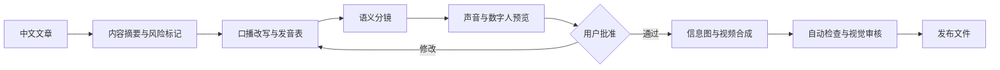

# Kanvis Cut

[English](README.en.md) | 中文

> 文章不是拿来逐字朗读的，而是拿来重新导演的。

Kanvis Cut 是一个开源的 Codex Skill + 基础视频工作台，用来把长文、课程稿和知识库内容变成可导演、可检查、可发布的视频项目。

当前内置的首个 workflow 是 `article-to-avatar-video`：从原文保真、口播改写和语义分镜，到真人增强、无人出镜、数字分身、信息图、字幕、多语种配音路径、音频、渲染与发布门禁。

当前版本：`v0.2.1`

## 它解决什么问题

普通数字人工具通常从“已有脚本”开始，最终输出一段人物口播。Kanvis Cut 从文章开始，先判断讲什么、怎么讲、什么时候应该让数字人退到画面一角，再把内容编排成可检查、可恢复、可替换供应商的视频项目。

它不是另一个 talking-head generator，而是一条内容视频生产流水线。

| 能力 | 普通数字人生成 | Kanvis Cut |
|---|---|---|
| 输入 | 已完成脚本 | 中文长文、公众号文章、Markdown |
| 内容处理 | 直接朗读 | 原文保真、口语改写、发音表、风险标记 |
| 视觉设计 | 人物全屏为主 | 比较、流程、数字、证据、引语、信息图、人物 PIP |
| 供应商 | 固定平台 | 可替换 voice/avatar adapter，可使用本地 CosyVoice |
| 质量控制 | 人工观看 | 分镜校验、媒体探测、授权检查、人工视觉门禁 |

## 与数字人口播 Skill 的区别

Kanvis Cut 不以“生成一个数字人视频”为中心，而以“把一篇中文长文重新导演成可发布视频”为中心。

| 维度 | 数字人口播 Skill | Kanvis Cut |
|---|---|---|
| 起点 | 已经写好的脚本、肖像和声音 | 中文长文、公众号文章、Markdown |
| 核心问题 | 如何安全调用声音和数字人供应商 | 如何把文章改写、分镜、视觉化并通过发布质检 |
| 画面策略 | talking-head 为主 | 信息图、证据、流程、对比和人物 PIP 轮换 |
| 成功标准 | 生成授权数字人口播成片 | 内容保真、画面有信息密度、成本受控、可发布 |
| 贡献重点 | provider API、素材预检、任务状态 | 文章改写规则、语义分镜、视觉语法、平台质检 |

如果你已经有一个完整脚本，只想做授权数字人口播，这不是最短路径。
如果你有大量文章、课程稿或知识库内容，想把它们变成有画面结构的视频，这正是本项目的范围。

维护者可参考 [docs/positioning-vs-talking-head-skills.md](docs/positioning-vs-talking-head-skills.md)，确保公开传播始终围绕 directed content-to-video pipeline，而不是某个供应商组合或数字人口播复刻。

## 工作流



## 三种生产模式

三种模式共用同一套内容、字幕、特效、封面、质检和导出流程，只切换出镜主体：

| 模式 | `presenter_mode` | 用途 |
|---|---|---|
| 真人增强 | `human` | 保留真人表演，增加字幕、信息图和特效 |
| 无人出镜 | `none` | 使用配音、文字、图表、截图和素材完成视频 |
| 数字分身 | `avatar` | 使用授权数字人，或真人表演驱动的 AI 换声/换嘴型 |

数字分身中的 `performance_lipsync` 必须说明真人表演来源，不能描述成完全由 AI 生成。详见 [docs/production-modes.md](docs/production-modes.md)。

可直接查看三种模式的配置：

- [真人增强](examples/modes/human-enhancement.config.json)
- [无人出镜](examples/modes/faceless-visual.config.json)
- [真人表演驱动数字分身](examples/modes/avatar-lipsync.config.json)

项目默认可在没有 MiniMax/HeyGen 付费额度时运行。硬件不足会退到 Mock 项目生成，不会暗中调用付费 API。详见 [docs/local-runtime.md](docs/local-runtime.md)。

## 亮点

- **Article-native**：保存原文，区分原始事实与推导，不把文章机械地逐段朗读。
- **语义驱动画面**：根据比较、流程、层级、数字、证据和引语选择视觉结构。
- **数字人不是永远的主画面**：证据和信息需要空间时，数字人自动退为 PIP 或暂时离场。
- **供应商可替换**：HeyGen、ElevenLabs、MiniMax 和本地 CosyVoice 都通过适配器契约接入。
- **付费动作可控**：支持 `off`、`confirm`、`auto` 三种付费策略、成本上限和任务缓存。
- **发布门禁可执行**：脚本会检查分辨率、FPS、时长、音轨、授权状态和人工视觉审核结果。

## 当前范围

这是一个 **Codex 编排 Skill**，不是托管服务，也不捆绑 HeyGen、MiniMax 或其他平台的 SDK、账号与额度。

仓库提供：

- 完整生产工作流与决策规则；
- 可移植的配置和分镜契约；
- 项目初始化、前置检查、分镜验证和成片质检脚本；
- 本地 CosyVoice 3.0 接入说明；
- 不包含真人素材的完整示例；
- 自动测试和 GitHub Actions。

具体的声音、数字人和渲染动作由当前 Codex 环境中已安装的 provider adapter 与 HyperFrames 工具完成。

## 开源剪辑工作台

仓库同时开放 [Kanvis Video Workbench](workbench/README.md) 的基础版，方便用户检查和微调 Agent 生成的视频项目，而不是只开放项目协议或展示截图。


基础工作台提供：

- 可选择、拖动和缩放图层的可视化画布；
- 支持定位、分割、删除和基础多轨编辑的时间轴；
- 文本、位置、尺寸、透明度、时长和特效参数调整；
- 实时特效预览与成片播放；
- 撤销与重做；
- 本地项目存储、预览服务和渲染任务；
- HyperFrames、Codex 和 MCP 接入。

源码位于 [`workbench/`](workbench/)，使用 MIT 许可证。它的定位是“基础检查与微调台”，不是完整商业生产后台；客户项目管理、批量队列、账号与供应商运营、私有模板库、团队 SOP、商业导出适配和客户交付系统不在本仓库范围内。参见 [Jianying / CapCut Export Strategy](docs/jianying-capcut-export.md) 了解项目导出方向。

## 安装

要求：

- Codex 或兼容的 Skill 运行环境；
- Node.js 20 或更高版本；
- `ffmpeg` 和 `ffprobe`，用于媒体检查；
- 需要渲染时安装 HyperFrames；
- 使用云端供应商时，自备账号、密钥、额度和素材授权。

将仓库放入 Codex skills 目录：

```bash
git clone https://github.com/Kanvis-chen/kanvis-cut ~/.codex/skills/kanvis-cut
```

启动新的 Codex 任务并显式调用：

```text
Use $article-to-avatar-video from Kanvis Cut to turn this Chinese article into a visually directed video project.
Show me the script, scene plan, provider cost, and preview before paid full-length generation.
```

默认禁用隐式触发，避免文章处理意外进入付费数字人生成。

## 快速体验

仓库附带一个完全离线、无真人素材的结构化示例：

```bash
npm test
npm run check
```

也可以手动运行：

```bash
node scripts/preflight.mjs \
  --article examples/knowledge-video/article.md \
  --config examples/knowledge-video/kanvis-cut.config.json

node scripts/detect-runtime.mjs \
  --config examples/knowledge-video/kanvis-cut.config.json

node scripts/init-project.mjs \
  --article examples/knowledge-video/article.md \
  --config examples/knowledge-video/kanvis-cut.config.json \
  --out ./demo-project

node scripts/validate-scene-plan.mjs \
  examples/knowledge-video/scene-plan.json
```

增加 `--paid` 可以检查项目是否已经满足付费生成所需的授权、资产 ID 和策略要求：

```bash
node scripts/preflight.mjs --article article.md --config kanvis-cut.config.json --paid
```

## 项目产物

一次完整任务建议保留以下中间产物：

```text
project/
├── input/source.md
├── kanvis-cut.config.json
├── project.json
├── work/
│   ├── content-brief.json
│   ├── voiceover.md
│   ├── pronunciations.json
│   ├── scene-plan.json
│   └── provider-jobs.json
└── output/
    ├── video.mp4
    ├── cover.jpg
    ├── title-and-description.md
    └── quality-report.json
```

这些中间文件让任务可以从失败阶段恢复，也让脚本、事实来源、远程任务 ID、成本和发布状态可追踪。

仓库也提供一个更通用的剪辑项目协议示例：

- [assets/kanvis-cut-project.schema.json](assets/kanvis-cut-project.schema.json)
- [examples/knowledge-video/kanvis-cut-project.json](examples/knowledge-video/kanvis-cut-project.json)

## 成片质检

```bash
node scripts/quality-check.mjs \
  --video output/video.mp4 \
  --config kanvis-cut.config.json \
  --report output/quality-report.json \
  --visual-review passed
```

只有自动检查没有阻断项，并且人工视觉审核为 `passed` 时，报告中的 `publish_ready` 才会变成 `true`。

## 安全边界

- 只处理用户拥有或明确获授权的文章、声音、肖像和品牌素材。
- 密钥只能来自环境变量，不得写入仓库、状态文件或日志。
- 不提交真实声音样本、私人肖像、客户视频、临时下载链接或本地路径。
- 新声音或新数字人先生成 10-15 秒预览，再决定是否生成完整视频。
- 对医疗、法律、金融、政治和时效性内容进行事实核验。
- 遵守目标平台对 AI 合成内容的披露要求。

参见 [SECURITY.md](SECURITY.md) 和 [references/acceptance-criteria.md](references/acceptance-criteria.md)。

## 开发

```bash
npm test
npm run check
```

贡献新的 provider adapter、视觉语法、平台预设或质量检查前，请阅读 [CONTRIBUTING.md](CONTRIBUTING.md)。

需要帮助时，请先看 [SUPPORT.md](SUPPORT.md)。版本变化见 [CHANGELOG.md](CHANGELOG.md)。

发布和社区增长计划见 [LAUNCH_PLAYBOOK.md](LAUNCH_PLAYBOOK.md)。
后续路线图见 [docs/roadmap.md](docs/roadmap.md)。
常见问题见 [docs/faq.md](docs/faq.md)。

## 路线图

- [x] 文章初始化、配置前检、分镜验证和媒体质检
- [x] 隐私安全的发布质检报告示例：`examples/knowledge-video/quality-report.example.json`
- [x] 可替换 provider 契约与本地 CosyVoice 指南
- [x] 无隐私的端到端结构示例和自动测试
- [ ] 官方 HeyGen/MiniMax provider adapter 实现
- [ ] 可复现的公开演示视频与基准成本报告
- [ ] 更多平台预设、字幕样式和中文发音词典
- [ ] 拆出 `cover-director`、`subtitle-director`、`effect-director` 的稳定示例
- [ ] 生成稳定的剪映/CapCut 导入资产包

## License

[MIT](LICENSE)
